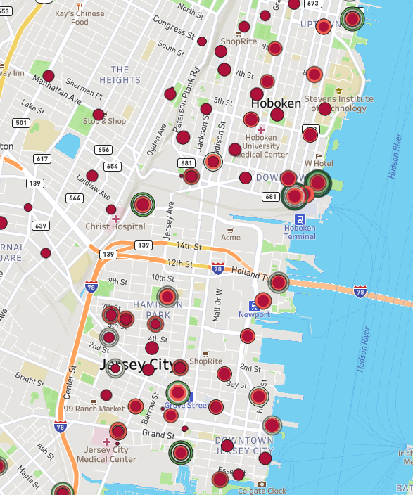
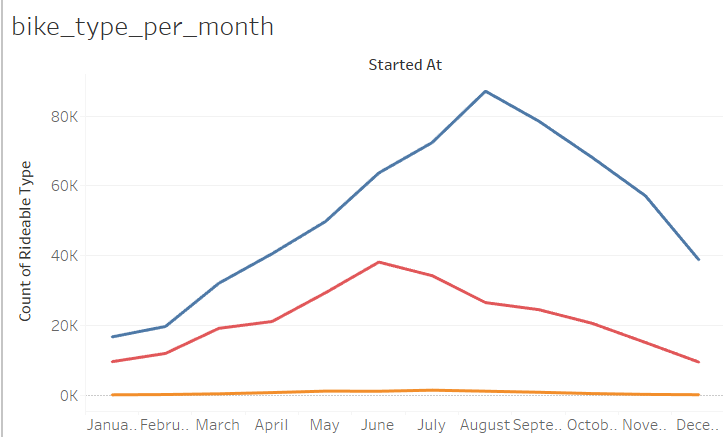
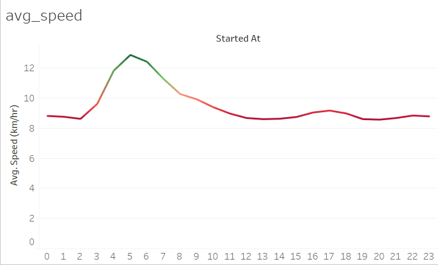
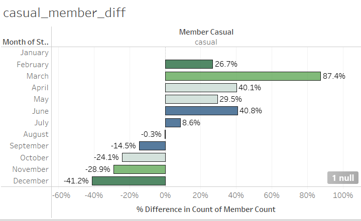

# CitiBike Visualization

I downloaded data from <https://s3.amazonaws.com/tripdata/index.html> for the year 2022.
I downloaded the monthly data for the entire year and combined them into one json file using python.
The data had the following fields :

    * ride_id
    * rideable_type
    * started_at
    * ended_at
    * start_station_name
    * start_station_id
    * end_station_name
    * end_station_id
    * start_lat
    * start_lng
    * end_lat
    * end_lng
    * member_casual

Link to Tableau Visualisation
[My Visualisation](https://public.tableau.com/views/CitiBikeViz_17261223266100/Rider_count_per_month?:language=en-US&publish=yes&:sid=&:redirect=auth&:display_count=n&:origin=viz_share_link)

## Analysis

### 1. The Map

The map shows all the starting locations for the CitiBike program. Using the slider on the right, one can interact with the map and see how the stations change during the year. During the year some stations disappear while new ones emerge. Also, some of the stations increase and decrease in size all throughout the year.
The popular stations are close to the downtown areas where most of the population might be concentrated and the parks.

### 2. Statistics

1. Classic bikes are the most used, with peak usage in August. This suggests that during summer months, which are ideal for biking, people prefer the classic bike. Electric bikes see the highest usage in June, which is just before the peak summer month. This could be due to the fact that electric bikes offer a more comfortable and less strenuous ride. Docked bikes have the lowest overall usage but usage peaks in July.

August’s peak usage aligns with classic bikes' highest usage. This is likely due to summer vacation, favorable weather, and possibly increased tourism or recreational activities that drive more people to use bikes. January’s low usage is consistent with colder weather and shorter daylight hours, which discourage biking. Additionally, post-holiday periods can see a dip in outdoor activities.
March: Significant Increase in Membership
This increase could be due to people resuming outdoor activities after winter, possibly driven by improved weather conditions and a desire to start the year with new fitness goals or commuting routines.
December: Significant Decrease in Membership
The drop in December could be due to the cold weather and holidays. Many people might choose to avoid biking in harsh weather conditions and prefer alternative modes of transportation.
2. There are two clear spikes in usage—one during the morning commute, around 8 AM  and another during the evening commute (around 5 PM to 6 PM).  There's also a smaller spike during lunchtime (around noon), likely driven by errands or casual rides.
Ridership tends to be higher on Saturdays and Wednesdays while it decreases on Sundays and Mondays.
It’s important to examine how rider behavior changes between weekdays and weekends. We expect more commuter rides during the workweek and more leisure rides on weekends.
Riders tend to travel longer distances during warmer months, likely because of the pleasant weather, which encourages more leisurely or recreational rides. During colder months, the average ride distance tends to be shorter, suggesting riders may use the service more for commuting or shorter trips.
Speeds tend to be highest around 5 AM, which is an interesting phenomenon worth exploring.
The higher speeds at 5 AM could be due to less traffic and fewer pedestrians on the road. With fewer obstacles, riders can travel more quickly.
This time likely correlates with early-morning commuters or fitness enthusiasts who prefer cycling when the streets are quieter.

3. There is more usage from members than from casual users all through the year. The number of actual members fluctuates all through the year whiles the number of casual uses tends to be staedy during the months of June, July, and August. Both types of memberships tend to increase during the month of March when the weather tends to be finer, and drops significantly in December when it gets colder.
For casual members, membership starts to decline in August and continues through to December, but for subscribed members, the numbers start to decline in September and continues through to December.

### Future Analysis

* Use wheater data to explore how daily temperatues and forecasts impact usage.
* Increase data and analyse changes in trends over the years.
* Find out how the distance travelled is impacted by fitness lifestyles of users.
* Predict how membership/usage is likely to increase or decrease over the years or due to weather conditions.
